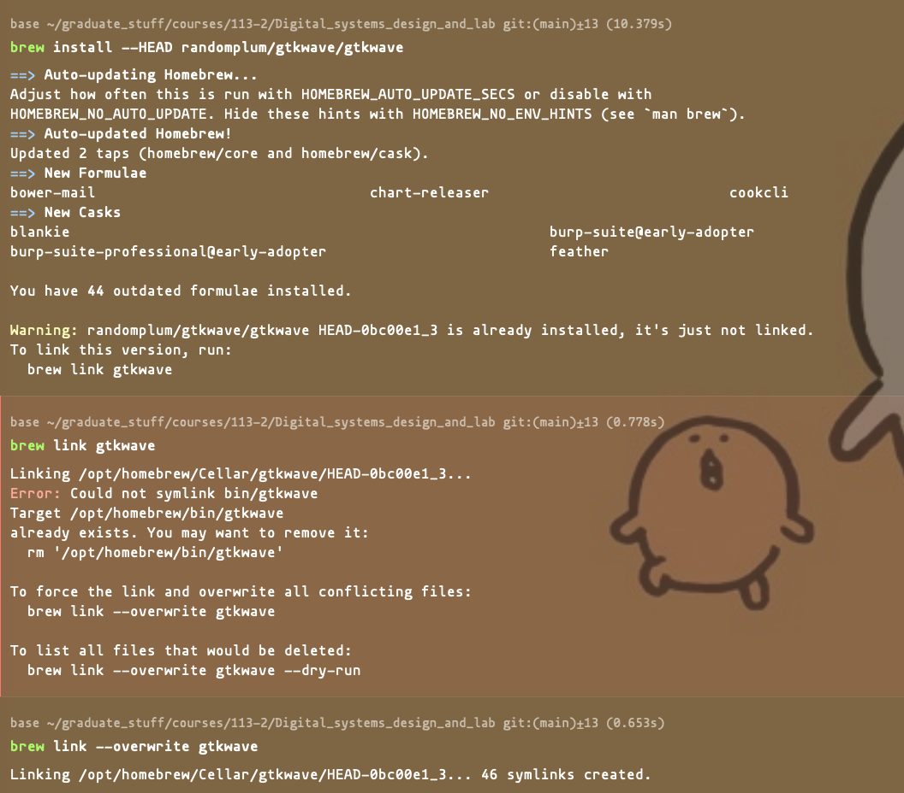

# Problem 1

The K-map in the solution is drawn using the "karnaugh-map" package, and should be included by adding:

`\usepackage{karnaugh-map}`

> For more information about how to draw a K-map by latex, please refer to this page: [Mattias Jacobsson: The karnaugh-map package](https://ctan.mines-albi.fr/graphics/pgf/contrib/karnaugh-map/karnaugh-map.pdf) 

## K-map ordering

:warning: **Be careful with the order when drawing K-map!**

Note that when using the package "karnaugh-map", we need to modify the ordering to match with our need, for example, in the following K-map:


In our ordinary convention, the red rectangle would be minterm $5, 7$, however, this package uses the ordering of $BAC$.

For example, the top $1$ in the red rectangle should be specified by $011$, which is $3$, and the bottom $1$ in the red rectangle should be specified by $111$, which is $7$.

Thus, when we're using `\implicant{}{}` in the K-map environment, this red rectangle is drawn by:

```latex
\begin{karnaugh-map}[2][4][1][$C$][$A$][$B$]
    % some other content
    \implicant{3}{7}
\end{karnaugh-map}
```

# Problem 2

For more details about how to draw a state diagram in latex, please refer to this page: 
- [Drawing Finite State Machines in Latex using tikz A Tutorial](https://www3.nd.edu/~kogge/courses/cse30151-fa17/Public/other/tikz_tutorial.pdf)


## State diagram appearance

Note that in order to have the same diagram setting (like arrows, gray background for the states), we need to define `tikzset` after we include the tikz package in the beginning of the tex document as follows:

```latex
\usetikzlibrary{automata, positioning, arrows}
\tikzset{
    ->, % makes the edges directed
    node distance=3cm, % specifies the minimum distance between two nodes. Change if necessary.
    every state/.style={thick, fill=gray!10}, % sets the properties for each ’state’ node
    }
```

# LAB 2
## Problem 4
### (2)

To show the waveform with the `lab2.sav` file on mac, we cannot use the application "surfer" as in the previous lab, since surfer does not support `.sav` files.

Thus, for mac users, execute the following command to fix the problem that gtkwave cannot be use in newer mac versions:

```
brew install --HEAD randomplum/gtkwave/gtkwave
brew link gtkwave
```

If when linking it showed the error as in the following image, execute the command:

```
brew link --overwrite gtkwave
```



After all these are done, the command:

```
gtkwave lab2.vcd lab2.sav 
```

could be properly executed.