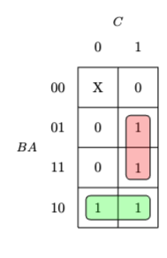

## Problem 1

The K-map in the solution is drawn using the "karnaugh-map" package, and should be included by adding:

`\usepackage{karnaugh-map}`

> For more information about how to draw a K-map by latex, please refer to this page: [Mattias Jacobsson: The karnaugh-map package](https://ctan.mines-albi.fr/graphics/pgf/contrib/karnaugh-map/karnaugh-map.pdf) 

### K-map ordering

:warning: **Be careful with the order when drawing K-map!**

Note that when using the package "karnaugh-map", we need to modify the ordering to match with our need, for example, in the following K-map:



In our ordinary convention, the red rectangle would be minterm $5, 7$, however, this package uses the ordering of $BAC$.

For example, the top $1$ in the red rectangle should be specified by $011$, which is $3$, and the bottom $1$ in the red rectangle should be specified by $111$, which is $7$.

Thus, when we're using `\implicant{}{}` in the K-map environment, this red rectangle is drawn by:

```latex
\begin{karnaugh-map}[2][4][1][$C$][$A$][$B$]
    % some other content
    \implicant{3}{7}
\end{karnaugh-map}
```


